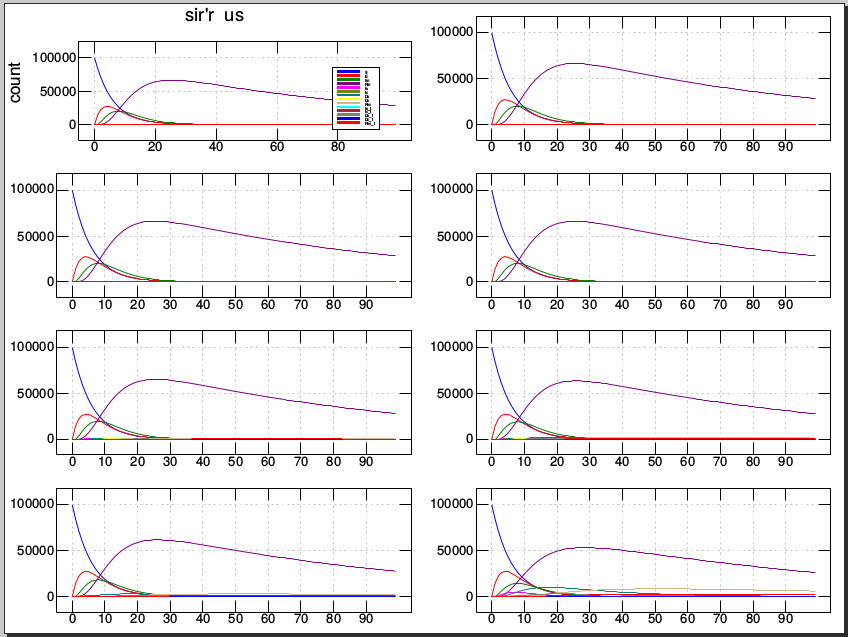

# Data-Morgana
Extended SIR models for modeling the outcome of pharmaceutical and non-pharmaceutical interventions. This is a first working version based on recently published model study by Abu-Raddad et al (https://www.sciencedirect.com/science/article/pii/S1755436522000214#!) Please see Appendix A (supplementary material) of this study for details about the used equations.

The code can be run on Windows, MacOS, Linux (also Raspberry) and Android using the array programming language J available as a free download from www.jsoftware.com. 

The project team can be contacted at research@bmrk.nl (www.biomedische-rekenkamer.nl)

Starting with a dummy array of 8 age groups in various compartments, you can run the SIR equations by calling the base routine and receive a corresponding array for each iteration using a simple Forward Euler with dt = 1 day.  
<pre>
      inputs
      
100000 10 10 10 10 10 10 10 10 10 10 10 10 10
100000 10 10 10 10 10 10 10 10 10 10 10 10 10
100000 10 10 10 10 10 10 10 10 10 10 10 10 10
100000 10 10 10 10 10 10 10 10 10 10 10 10 10
100000 10 10 10 10 10 10 10 10 10 10 10 10 10
100000 10 10 10 10 10 10 10 10 10 10 10 10 10
100000 10 10 10 10 10 10 10 10 10 10 10 10 10
100000 10 10 10 10 10 10 10 10 10 10 10 10 10

   Run four iterations on an array of eight age groups in 14 categories, transpose and box. 
   
      <"2  |: sirseci  ^:(i. 4) |:inputs
┌──────────────────────────────┬──────────────────────────────┬──────────────────────────────┬──────────────────────────────┬──────────────────────────────┬──────────────────────────────┬──────────────────────────────┬──────────────────────────────┐
│100000 84523.4 71441.9 60385.1│100000 84523.4 71441.9 60385.1│100000 84523.4 71441.9 60385.1│100000 84523.4 71441.9 60385.1│100000 84523.4 71441.9 60385.1│100000 84523.4 71441.9 60385.1│100000 84523.4 71441.9 60385.1│100000 84523.4 71441.9 60385.1│
│    10 14220.2   22200 26057.1│    10 14220.2   22200 26057.1│    10 14220.2   22200 26057.1│    10 14220.2   22200 26057.1│    10 14220.2   22200 26057.1│    10 14220.2   22200 26057.1│    10 14220.2   22200 26057.1│    10 14220.2   22200 26057.1│
│    10 9.70625  3855.1 8706.41│    10 9.69487 3838.91 8669.81│    10 9.67752 3814.23 8614.03│    10 9.66777 3800.35 8582.66│    10 9.62224 3735.58 8436.24│    10 9.53064 3605.26 8141.67│    10 9.42495 3454.89 7801.78│    10 8.91492 2729.27 6161.58│
│    10 13.3424 16.7032 1125.09│    10 13.3424 16.6999 1120.43│    10 13.3424 16.6949 1113.34│    10 13.3424 16.6921 1109.35│    10 13.3424  16.679 1090.72│    10 13.3424 16.6527 1053.25│    10 13.3424 16.6224 1010.01│    10 13.3424 16.4758 801.358│
│    10 6.00272 7.45535 10.4895│    10 6.01356 22.8767 43.8073│    10 6.02711 42.1533 85.4546│    10 6.03253  49.864 102.114│    10 6.06235 92.2726 193.738│    10 6.12197  177.09 376.986│    10  6.2114 304.316 651.858│    10 6.74798 1067.67 2301.09│
│    10  6.0011 5.14215  5.4918│    10 6.00164 5.91321 7.15769│    10 6.00543 11.3107 18.8189│    10 6.00977 17.4792 32.1461│    10 6.02549 39.8401 80.4569│    10 6.05747  85.333 178.745│    10 6.07373 108.465 228.721│    10 6.04717 70.6827 147.093│
│    10   12.39 13.5158 15.0045│    10   12.39 13.5189 19.4389│    10   12.39 13.5228 24.9819│    10   12.39 13.5243 27.1991│    10   12.39 13.5329 39.3936│    10   12.39   13.55 63.7827│    10   12.39 13.5757 100.366│    10   12.39 13.7299 319.868│
│    10  12.509 13.7775 14.7529│    10  12.509 13.7777 14.9747│    10  12.509 13.7788 16.5267│    10  12.509   13.78 18.3005│    10  12.509 13.7845 24.7304│    10  12.509 13.7937 37.8119│    10  12.509 13.7984 44.4635│    10  12.509 13.7908 33.5992│
│    10 10.4688 11.0768 11.7475│    10 10.4688 11.0768 11.7476│    10 10.4688 11.0768 11.7478│    10 10.4688 11.0768 11.7479│    10 10.4688 11.0768 11.7483│    10 10.4688 11.0768 11.7491│    10 10.4688 11.0768 11.7501│    10 10.4688 11.0768 11.7555│
│    10 8.00001 6.20029 5.08575│    10 8.00001 6.20138 6.62864│    10 8.00001 6.20273 8.55725│    10 8.00001 6.20328  9.3287│    10 8.00001 6.20626 13.5716│    10 8.00001 6.21222 22.0575│    10 8.00001 6.22116 34.7864│    10 8.00001 6.27482 111.159│
│    10 8.00001 6.20013 4.85432│    10 8.00001 6.20019 4.93146│    10 8.00001 6.20057 5.47147│    10 8.00001   6.201 6.08863│    10 8.00001 6.20257 8.32582│    10 8.00001 6.20577 12.8773│    10 8.00001 6.20739 15.1917│    10 8.00001 6.20474 11.4116│
│    10 12.1026 13.5864 14.5329│    10 12.1026 13.5864 14.5332│    10 12.1026 13.5864 14.5335│    10 12.1026 13.5864 14.5337│    10 12.1026 13.5864 14.5344│    10 12.1026 13.5864  14.536│    10 12.1026 13.5864 14.5383│    10 12.1026 13.5864 14.5522│
│    10 12.2215 13.8447 14.9433│    10 12.2211 13.8438 14.9419│    10 12.2197 13.8408 14.9371│    10 12.2157  13.832 14.9233│    10 12.2017 13.8015 14.8749│    10 12.1317 13.6493 14.6338│    10 11.9817 13.3263 14.1261│    10 11.2117 11.7396 11.7306│
│    10 10.4688 11.0597 11.7348│    10 10.4689 11.0598 11.7349│    10  10.469 11.0601 11.7353│    10 10.4694 11.0609 11.7364│    10 10.4708 11.0636 11.7404│    10 10.4778 11.0774 11.7598│    10 10.4928 11.1064 11.8005│    10 10.5698 11.2486 11.9897│
└──────────────────────────────┴──────────────────────────────┴──────────────────────────────┴──────────────────────────────┴──────────────────────────────┴──────────────────────────────┴──────────────────────────────┴──────────────────────────────┘
   
      </pre>
        
       Use the printing routine for say 100 iterations, e.g. prseci 100
             
